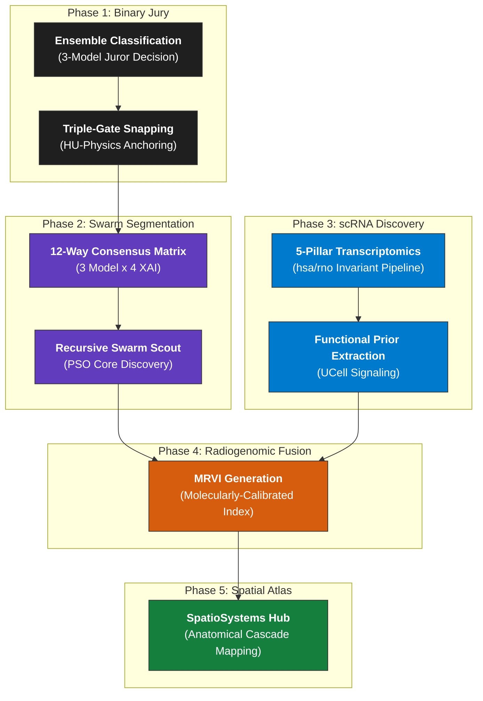

<p align="center">
  
</p>

<p align="center">
  
  
  
</p>

---

<div align="center">
  <h2>⚡ IS_Radiogenomic_Fusion_MRVI ⚡</h2>
  <sub>The Molecular Radiomics Vulnerability Index (MRVI): A multi-modal framework for anchoring AI imaging features to single-cell transcriptomic priors.</sub>
</div>

---

> [!CAUTION]
> **STRICT INTELLECTUAL PROPERTY NOTICE**
>
> This repository contains proprietary scientific architecture (The Triple-Gate Protocol & MRVI Engine). **Unauthorized replication, conceptual imitation, or architectural copying for independent publication is strictly prohibited.** This code is the intellectual property of **Vidit Zainith** and serves as a prior-art methodological reference.

---

## 📁 The 5-Phase Fusion Pipeline



---

## 📁 Repository Structure

```text
IS_Radiogenomic_Fusion_MRVI/
│
├── phase1_binary_classification/    ← Triple-Gate HU physics & 3-model ensemble
├── phase2_lesion_segmentation/      ← 12-way consensus & PSO Swarm Scout
├── phase3_scRNA_analysis/           ← 5-Pillar scRNA-seq Discovery Suite
├── phase4_radiogenomic_fusion/      ← MRVI generation (Imaging-Molecular bridge)
├── phase5_spatial_transformation/   ← SpatioSystems Atlas mapping
├── orchestration/                   ← Master parallel harvesters & launchers
└── requirements.txt                 ← SOTA Bio-AI Hardware dependencies
```

---

## 💡 Key Innovations

| Framework | Innovation |
|-----------|------------|
| **Triple-Gate Protocol** | Anchors "AI Hotspots" to Hounsfield Unit (HU) anatomical reality. |
| **Recursive Swarm Scout** | PSO-optimized search for the primary ischemic core within noise. |
| **MRVI Index** | Weights digital texture disorganization with single-cell molecular priors. |
| **SpatioSystems Hub** | Patient-specific NVU cascade detection anchored to brain territories. |

---

## 🛠️ Research Arsenal & Compute


---

## 📜 Legal & IP Attribution

- **Principal Architect:** **Vidit Zainith ([@VampZie](https://github.com/VampZie))**
- **Temporal Attribution:** Methodological archive established as of **April 21, 2026**.
- **Portfolio Reference:** This repository is a high-fidelity methodological demonstration of clinical radiogenomic fusion.

---
<div align="center">
  
</div>
